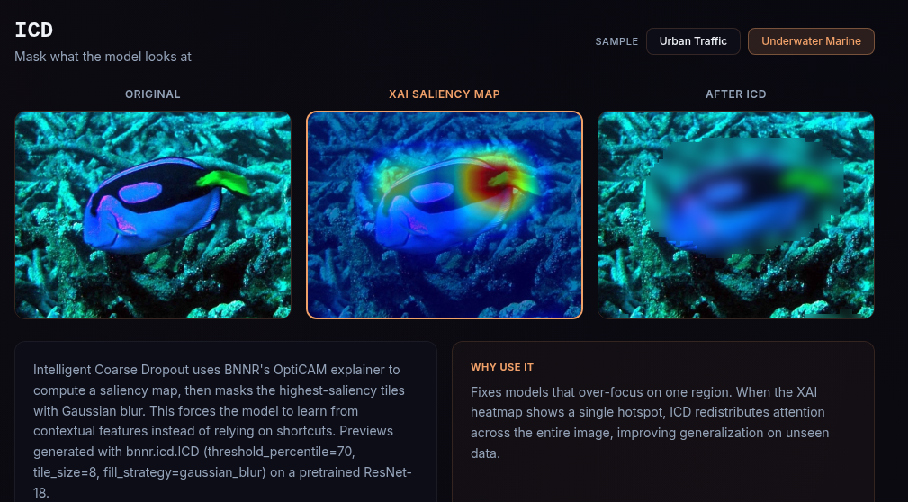
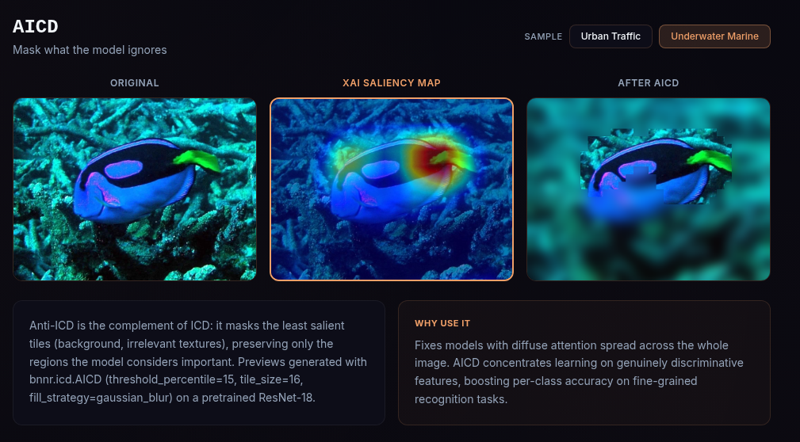
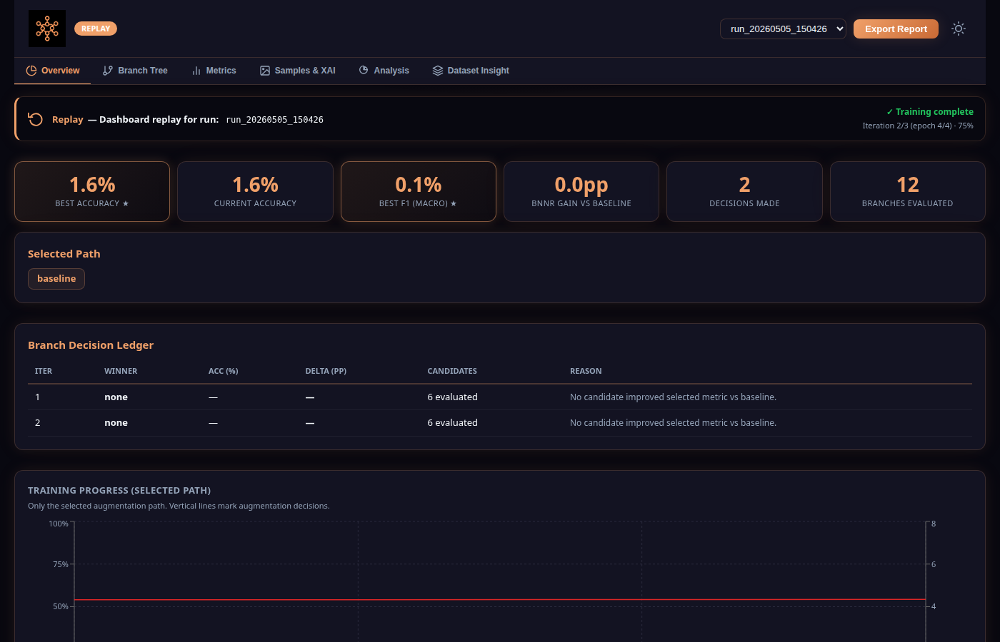
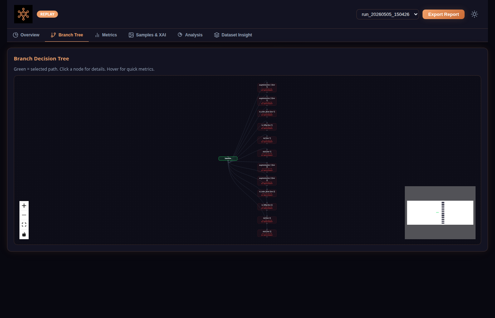
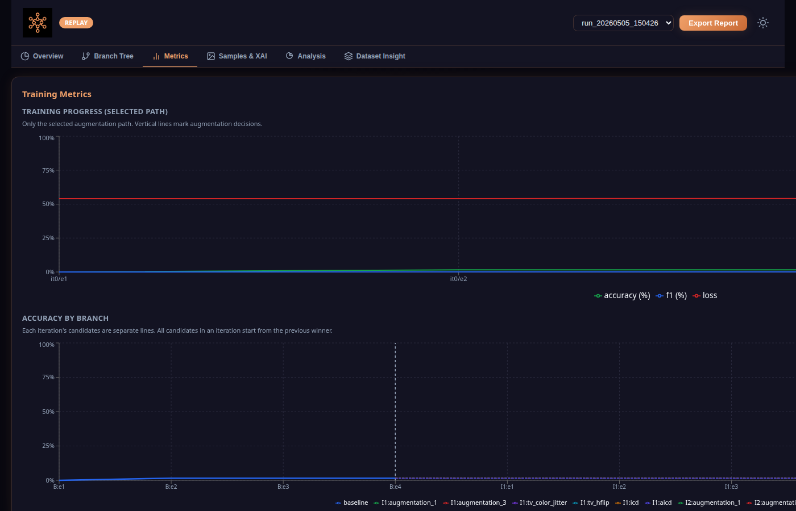
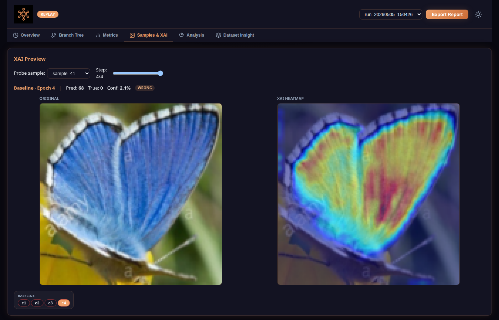
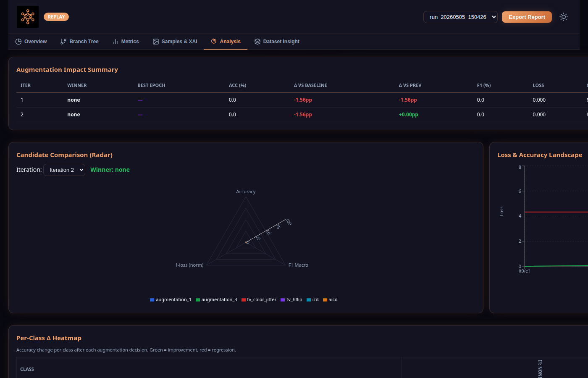
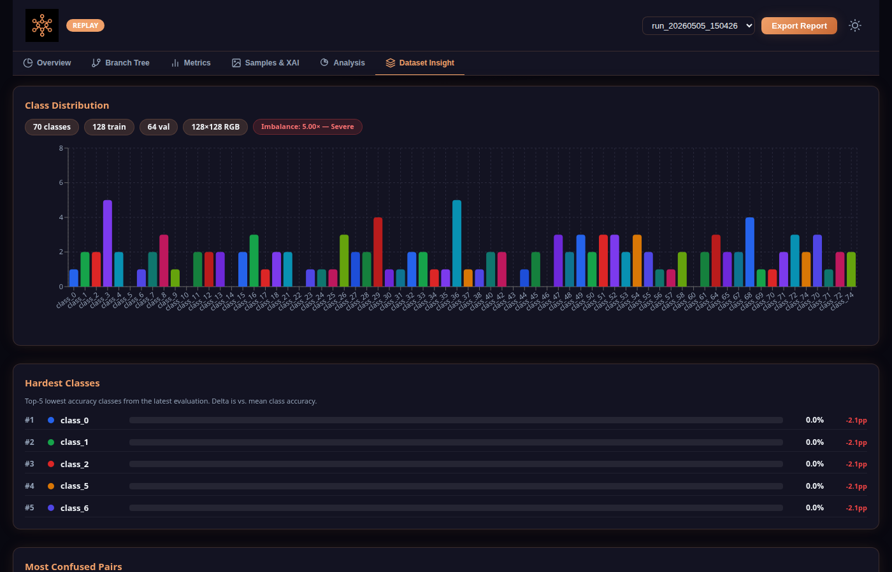

<p align="center">
  
</p>

<p align="center">
  <a href="https://pypi.org/project/bnnr/"></a>
  <a href="https://pypi.org/project/bnnr/"></a>
  <a href="https://github.com/bnnr-team/bnnr/stargazers"></a>
  <a href="https://pepy.tech/projects/bnnr"></a>
  <a href="https://github.com/bnnr-team/bnnr/blob/main/LICENSE"></a>
  <a href="https://github.com/bnnr-team/bnnr/actions/workflows/ci.yml"></a>
</p>

<p align="center">
  <a href="https://www.bnnr.dev/">Website</a>
  ·
  <a href="https://www.linkedin.com/company/bnnr/">LinkedIn</a>
</p>

<p align="center">
  <video width="720" controls playsinline poster="https://raw.githubusercontent.com/bnnr-team/bnnr/main/docs/assets/hero-promo-poster.jpg">
    <source src="https://raw.githubusercontent.com/bnnr-team/bnnr/main/docs/assets/hero-promo.mp4" type="video/mp4">
    <a href="https://www.bnnr.dev">Watch the demo on bnnr.dev</a>
  </video>
</p>
<p align="center"><em>Demo with audio (1280p). Original 4K recording: <a href="https://www.bnnr.dev">bnnr.dev</a></em></p>

# BNNR (Bulletproof Neural Network Recipe)

<p align="center"><strong>Train → Explain → Improve → Prove</strong></p>

**BNNR automatically improves your PyTorch vision models using XAI** — find what your model gets wrong, fix it with intelligent augmentation, and prove the result with structured reports and a live dashboard.

Supported tasks (**v0.4.10**): single-label classification, multi-label classification, and object detection (COCO-mini / YOLO). See [Documentation](docs/README.md) ([detection](docs/detection.md) · [analyze](docs/analyze.md) · [benchmarks](docs/benchmarks.md)).

**Try without installing:** [sample analyze HTML report](https://raw.githack.com/bnnr-team/bnnr/refs/heads/main/docs/assets/analyze-report-sample.html) (MNIST, real run — confusion pairs, XAI heatmaps, recommendations).

---

## Quickstart

```bash
pip install "bnnr[dashboard]"

# Zero flags — CIFAR-10 demo CNN, ICD preset, live dashboard (~1 min)
python3 -m bnnr demo
```

Interactive wizard (prompts for dataset/preset; sample limits 128/64):

```bash
python3 -m bnnr quickstart
```

Full CLI training with built-in defaults:

```bash
python3 -m bnnr train --dataset cifar10 --preset light --with-dashboard
```

Open `http://127.0.0.1:8080/` for the live dashboard (QR code in terminal for mobile on the same Wi-Fi).

Advanced: pass `--config path.yaml` to override defaults.

---

## XAI-driven augmentations (ICD & AICD)

BNNR uses saliency maps to guide augmentation — not random flips and crops.

<p align="center">
  
</p>
<p align="center"><strong>ICD</strong> — masks the regions the model already focuses on (highest saliency), forcing it to learn from context instead of shortcuts.</p>

<p align="center">
  
</p>
<p align="center"><strong>AICD</strong> — masks low-saliency background and irrelevant textures, sharpening focus on discriminative features.</p>

---

## Benchmarks

| Dataset | Without BNNR | BNNR branch search | RandAugment |
|---------|--------------|--------------------|-------------|
| CIFAR-10 | 75.3% | 81.4% | 72.5% |

Median validation accuracy, 3 seeds (42–44), demo CNN on CIFAR-10. Baselines: 5 epochs fixed; BNNR: full branch-search pipeline (more compute). Not SOTA — illustrative comparison. Details: [`benchmarks/README.md`](benchmarks/README.md) · reproduce: [`benchmarks/run.py`](benchmarks/run.py) → [`benchmarks/summarize.py`](benchmarks/summarize.py).

### Where the model looks (OptiCAM)

Same CIFAR-10 validation image (test index **127**, seed 44): **original input** plus OptiCAM overlays after three training setups. With crop+flip only, attention scatters toward **image edges**; RandAugment is more centered but diffuse. After BNNR branch search (ICD + AICD + ChurchNoise), heatmaps concentrate on the **vehicle body**.

<p align="center">
  
</p>

<p align="center"><em>Original → crop+flip · RandAugment (2,9) · BNNR branch search. Illustrative example from the benchmark harness.</em></p>

Full overlays for 8 fixed val indices: `benchmarks/runs/*/xai/` · regenerate figure: `python scripts/build_benchmark_xai_readme_asset.py --pick val127`

---

## Live dashboard

Real metrics from a BNNR training run — branch tree, charts, XAI previews, and dataset insights.

| Overview | Branch Tree | Metrics |
|:---:|:---:|:---:|
|  |  |  |

| Samples & XAI | Analysis | Dataset Insight |
|:---:|:---:|:---:|
|  |  |  |

---

## Analyze an existing model

If you already have a trained checkpoint, run diagnostics without retraining:

```bash
pip install bnnr
python3 -m bnnr analyze --model checkpoints/best.pt --data cifar10 --output ./analysis_out
```

**No checkpoint yet?** Open the [sample HTML report](https://raw.githack.com/bnnr-team/bnnr/refs/heads/main/docs/assets/analyze-report-sample.html) from a MNIST run (metrics, confused pairs, saliency on failures).

See [docs/analyze.md](docs/analyze.md) for the full workflow.

---

## What makes BNNR different

- **XAI-driven augmentation (ICD / AICD)** — augmentations guided by saliency maps; no other PyTorch toolkit combines explainability and data augmentation this way.
- **Auto-augmentation search** — iterative branching keeps only augmentations that measurably improve your validation metric.
- **Auditable reports** — structured JSON reports with metrics, XAI heatmaps, and branch decisions for stakeholders or compliance review.

---

## Links

| Resource | URL |
|----------|-----|
| Website | [bnnr.dev](https://www.bnnr.dev/) |
| LinkedIn | [BNNR on LinkedIn](https://www.linkedin.com/company/bnnr/) |
| Documentation | [docs/README.md](docs/README.md) |
| Examples | [docs/examples.md](docs/examples.md) |
| Colab (classification) | [Open in Colab](https://colab.research.google.com/github/bnnr-team/bnnr/blob/main/examples/classification/bnnr_classification_demo.ipynb) |
| API reference | [docs/api_reference.md](docs/api_reference.md) |
| Model analysis (`bnnr analyze`) | [docs/analyze.md](docs/analyze.md) |
| Integrations (Grad-CAM, Ultralytics YOLO) | [docs/integrations.md](docs/integrations.md) |
| Sample analyze report (live HTML) | [raw.githack.com preview](https://raw.githack.com/bnnr-team/bnnr/refs/heads/main/docs/assets/analyze-report-sample.html) |
| GitHub Discussions | [Q&A and showcase](https://github.com/bnnr-team/bnnr/discussions) |

---

## Python API

```python
import bnnr

result = bnnr.quick_run(model, train_loader, val_loader)
print(result.best_metrics)
```

For a one-epoch smoke test: `bnnr.quick_run(..., m_epochs=1, max_iterations=1)`.

Advanced: [Golden path](docs/golden_path.md) (`BNNRTrainer`, custom adapters, detection). API details: [api_reference.md](docs/api_reference.md).

---

## Documentation

<details>
<summary><strong>Install from source, CLI reference, full doc index</strong></summary>

### Install from source

```bash
git clone https://github.com/bnnr-team/bnnr.git
cd bnnr
(cd dashboard_web && npm ci && npm run build)
pip install -e ".[dev,dashboard]"
```

The PyPI **wheel** ships the `bnnr` package only. Runnable scripts (`examples/`), notebooks, and the documentation tree (`docs/`) live in this repository.

### Main CLI commands

```bash
python3 -m bnnr --help
python3 -m bnnr demo
python3 -m bnnr train --help
python3 -m bnnr analyze --help
python3 -m bnnr report --help
python3 -m bnnr list-datasets
python3 -m bnnr list-augmentations -v
python3 -m bnnr list-presets
python3 -m bnnr dashboard serve --run-dir reports --port 8080
python3 -m bnnr dashboard export --run-dir reports/run_YYYYMMDD_HHMMSS --out exported_dashboard
```

### Doc index

- [Getting started](docs/getting_started.md)
- [Python quickstart (`quick_run`)](docs/quickstart_api.md)
- [Configuration](docs/configuration.md)
- [CLI](docs/cli.md)
- [Dashboard](docs/dashboard.md)
- [Augmentations](docs/augmentations.md)
- [Detection](docs/detection.md)
- [Analyze (standalone diagnostics)](docs/analyze.md)
- [Examples](docs/examples.md)
- [Notebooks](docs/notebooks.md)
- [Artifacts](docs/artifacts.md)
- [Benchmarks](docs/benchmarks.md)
- [Citation](docs/citation.md)
- [Troubleshooting](docs/troubleshooting.md)

### Requirements

- Python `>=3.10`
- Core: `torch`, `torchvision`, `numpy`, `typer`, `pydantic`, `pyyaml`, `grad-cam`
- Dashboard extra: `fastapi`, `uvicorn`, `websockets`, `qrcode`

</details>

---

## Citation

If you use BNNR in academic work or publish an integration that builds on it, cite the repository (all authors: Walo, Morzhak, Zydorczyk, Saczuk). BibTeX: [docs/citation.md](docs/citation.md). Authors and roles: [AUTHORS.md](AUTHORS.md). GitHub: **Cite this repository** (`CITATION.cff`).

---

## License

MIT License — use BNNR freely in research, production, and commercial projects.

If BNNR saved you time debugging a vision model, consider [starring the repo](https://github.com/bnnr-team/bnnr) — it helps others discover the project.
